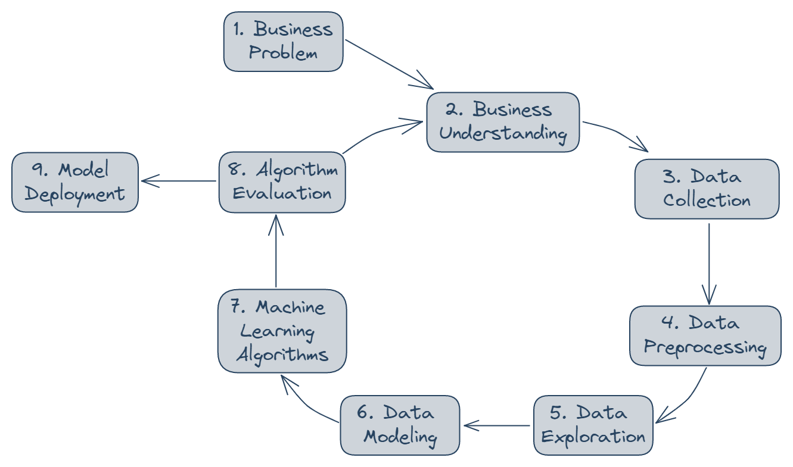
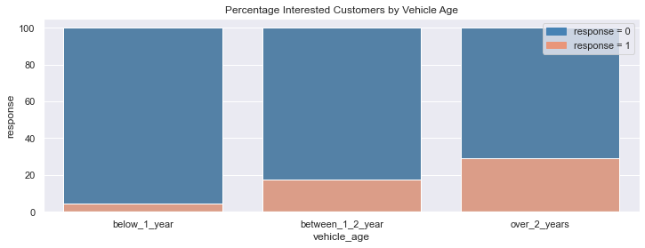
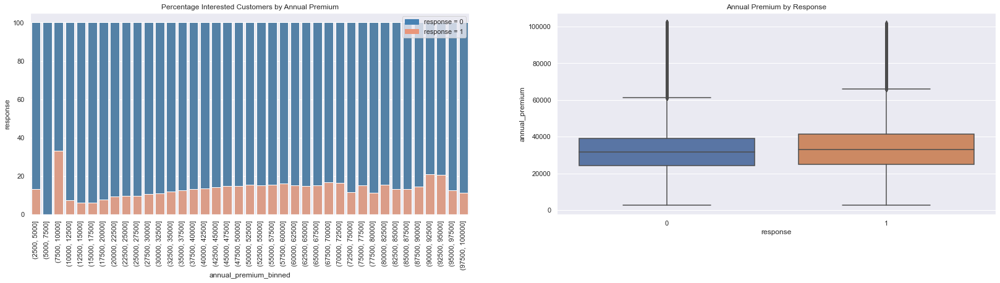
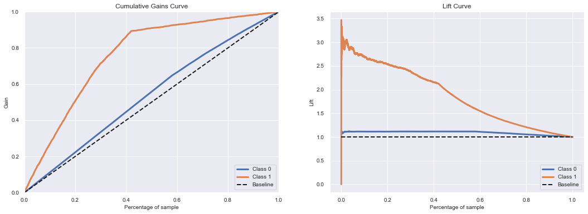
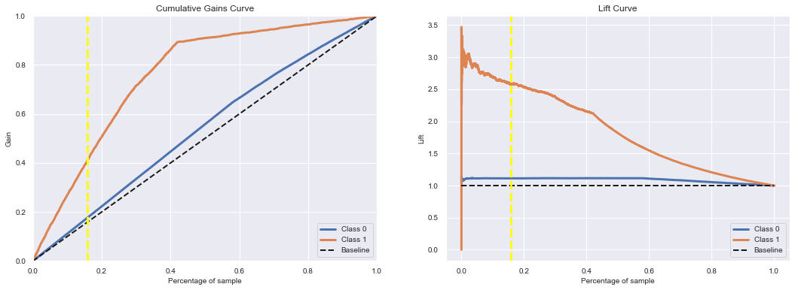
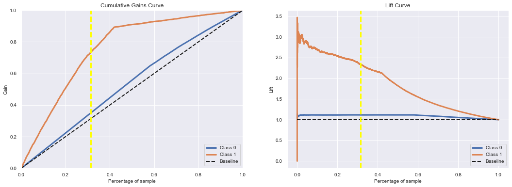
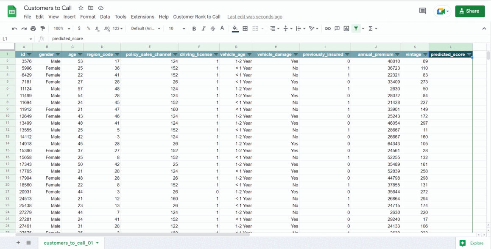

# Learning to Rank for Insurance Cross Sell

  
 

A classification/ranking project aimed to detect health insurance customers most likely to buy a new type of insurance from the company - car insurance. To solve this problem a machine learning model was built to classify the customers by their probability of buying the insurance. The planning and development of the solution were made following all the steps of a real market project.

The data used is available on [Kaggle](https://www.kaggle.com/datasets/anmolkumar/health-insurance-cross-sell-prediction). All additional information below is fictional.

## Business Problem
A traditional health insurance company wants to expand its business. Among the possibilities, the company has chosen to offer a new product to its customers, car insurance. 

Through a survey conducted last year, it obtained feedback from 380,000 customers about their interest in acquiring car insurance. All customers expressed interest or not in acquiring auto insurance, and these responses were stored in a database along with the customer's other attributes. 

The product team plans a campaign for 127,000 new customers who did not respond to the survey, in which they will be offered the car insurance product. The company realized that it would not be able to reach this entire customer base, as it will use telephone calls to offer the product, and the sales team has the capacity to make 20,000 calls in the campaign period. 

This is when the data team comes into play! The data team has been tasked to build a model that predicts the likelihood that a customer is interested in car insurance. With the solution, the sales team hopes to be able to prioritize the customers most interested in car insurance and thus optimize the campaign by making only contacts with the customers most likely acquiring the car insurance.

As a result, the data team will need to deliver a report containing some analysis and answers to the following questions:

* Key insights into the most relevant attributes of customers interested in acquiring car insurance.
* What percentage of customers interested in acquiring car insurance can the sales team reach with 20,000 calls?
* And if the capacity of the sales team increases to 40,000 calls, what percentage of customers interested in purchasing auto insurance will the sales team be able to contact?
* How many calls does the sales team need to make to contact 90% of the customers interested in acquiring car insurance?

## Business Results Overall
Making 20,000 calls from a list of 127,000 customers, the model would be able to identify 44% of the total number of customers interested in acquiring car insurance, with the ML model being approximately 2.7 times better than random choice. Increased to 40,000 calls the model would be able to identify 75% of the total number of customers interested in purchasing auto insurance, meaning that the ML model is approximately 2.3 times better than random choice. 

Considering the price of car insurance as an annual average of 1,630.00 USD, the model can increase the company's revenue by up to 58,484,400.00 USD and 93,057,500.00 USD with 20,000 calls and 40,000 calls respectively.

To reach 90% of interested customers, with the ML model the sales team will only have to make 53,340 calls, which represents 42% of the entire customer list. This represents a 48% reduction in the number of calls compared to random choice.

## Business Assumptions
* The average annual price of car insurance is 1,630.00 USD.
* The company will contact its customers through phone calls.
* The company has limited resources and limited phone calls to contact its customers.
* Before the project, the company's strategy was to randomly choose customers to make the phone call.
* The sales team already uses Google Sheets as a corporate tool. The ranking of propensity to acquire car insurance needs to be incorporated into it.
* The description of variables goes as in [Kaggle](https://www.kaggle.com/datasets/anmolkumar/health-insurance-cross-sell-prediction).

## Solution Strategy
The adopted solution is based on the CRISP-DM method (Cross Industry Standard Process for Data Mining), a cyclical and flexible methodology for solving problems involving large volumes of data that enables the rapid delivery of value to the business teams. Below is an illustration of the main steps of the solution.   

  
  

1. Build an ordered list of health insurance customers who are most likely to buy car insurance from the company.

2. Understanding how an insurance product works and finding clues that lead customers to buy the new insurance. Understanding how the variables are related to the likelihood of accepting the new product.

3. Collect the data in a database in the AWS Cloud, using SQL, and import it to a Jupyter Notebook.

4. Understand the meaning of each attribute. Rename necessary columns, and understand dimensions and data types. Identify and handle null values. Analyze attributes using descriptive statistics. Create a business hypothesis mindmap, and perform feature engineering needed for hypothesis validation. Filter records and attributes according to business constraints. Separate the data for training, validation, and testing. 

5. Use the preprocessing training dataset to discover insights, answer questions, evaluate the hypothesis, and uncover hidden information from the data. You can see the analysis in my [Jupyter Notebook](https://github.com/anaclaudialemos/learning_to_rank_for_cross_sell/blob/main/learning_to_rank_for_cross_sell_cycle01.ipynb).

6. Since machine learning algorithms are facilitated with numerical data that is at the same scale, apply rescaling, encoding, and transformation techniques to prepare the data. Use the knowledge obtained in EDA and the Extra Tree Classifier to select the most relevant features for our model.

7. Build different classification/ranking models based on our dataset. Use the cross-validation method to ensure that the solution is robust, not over-fitted, and generalizable to no-see data. Compare the results of the models concerning the chosen performance metrics (Precision, Recall, Cumulative Gains Curve, Lift Curve), and from the comparison, choose a model to proceed with. Perform hyperparameter fine-tuning on the chosen model, via random search using some sample parameters. Models to be built: Logistic Regression, KNN, Randon Forest, and LGBM. 

8. Analyze the final model results relative to the model performance metrics, and translate these results into business language so that other teams can better understand and form their opinion. If the overall result is good enough, move to the deployment phase. If the teams decide to change any aspect of the project, another CRISP-DM cycle takes place.

9. Use the Heroku platform to deploy the ML model, which will respond to requests via API. Interface the solution with [Google Sheets](https://docs.google.com/spreadsheets/d/1SeznNLKXQZdeq2J4Pn-42zHSh26EjeDa2_dR7Cbtkdc/edit?usp=sharing), so the sales team can use it with ease.

## Top 3 Data Insights
1. The youngest and oldest customers are the least interested in car insurance.

  
  

2. Customers with cars older than 2 years are more interested in car insurance.

  
  

3. With a few exceptions, interested customers are distributed somewhat evenly over different amounts of annual premiums.

  
 

## Machine Learning Models
To solve this problem, models were built to gather the probability that a given customer will acquire car insurance. Classification algorithms were used, but instead of obtaining the classes (interested and not interested in car insurance), we will obtain the probability of belonging to the class interested in acquiring car insurance, and sort the customer list from the highest probability to the lowest. In each model built, the baseline performance was considered a random choice among the entire list of customers.

To decide the best model, the metrics Precision, Recall, Cumulative Gains Curve, and Lift Curve were chosen. Precision refers to the percentage of customers that our model defined as high probability and are interested in insurance. Recall refers to the total number of interested customers, what was the percentage captured by our model. Cumulative Gains Curve shows the percentage of the overall number of cases in a given category "gained" by targeting a percentage of the total number of cases. A Lift Curve represents the improvement that a model provides when compared to a random choice.

### Models Performances
By applying the Cross Validation technique to the chosen algorithms, the following results were obtained at 20% of the data:

  
| Model               | Precision at 20%  | Recall at 20%   | 
| ------------------- | :---------------: | :-------------: | 
| Logistic Regression | 0.33 +/- 0.0033	  | 0.54 +/- 0.0053 | 
| KNN	                | 0.37 +/- 0.0068   | 0.61 +/- 0.0111 | 
| Random Forest	      | 0.33 +/- 0.0060   | 0.53 +/- 0.0097 | 
| LGBM       	        | 0.35 +/- 0.0028   | 0.58 +/- 0.0045 |

For this problem, we consider Precision more important than Recall, since we are interested in the model achieving as many values as possible in the window of values up to k. As we can see the model with the best performance for Precision and also Recall is KNN, and this was chosen as the final model.

### Final Model Performance

To improve the chosen model a fine tuning of the hyperparameter was done, through a random search using some sample parameters. The random search done uses cross validation, below is the single performance.

  
| Model       | Precision | Recall  | 
| ----------- |:---------:|:-------:| 
| KNN (10%)   | 0.49	    | 0.39    | 
| KNN	(20%)   | 0.42      | 0.69    | 
| KNN (30%)   | 0.32      | 0.78    | 
| KNN (40%)   | 0.28      | 0.89    |
 
 

  
 

From the results achieved, we see that with the ML model, calling only 40% of the entire customer list, we will reach 89% of interested customers (Cumulative Gains Curve). However, to reach this 89% of interested customers, the base model (random choice) will have to call 89% of the entire customer list. We also see from the Lift Curve that The ML model is at least twice better a the base model when we call a maximum of 40% of the entire customer list.

## Business Results
### Making Only 20,000 Calls
By making only 20,000 calls from a list of 127,000 customers, the model would be able to identify 44% of the total number of customers interested in acquiring car insurance. This means that The ML model is approximately 2.7 times better than the random choice.

  
 

Considering the price of car insurance as an annual average of 1,630,00 USD, the income over the base of 127,000 customers with 20,000 calls can be up to:

  
| Random Choice     | ML Model          |
| ----------------- | ----------------- | 
| 32,600,000.00 USD | 91,084,400.00 USD |

   
As we see, the ML model can increase the company's revenue up to 58,484,400.00 USD over 127,000 customers with 20,000 calls.

### Increased to 40,000 Calls
By making 40,000 calls from a list of 127,000 customers, the model would be able to identify 75% of the total number of customers interested in acquiring car insurance. This means that The ML model is approximately 2.3 times better than the random choice.

  
 

Considering the price of car insurance as an annual average of 1,630,00 USD, the income over the base of 127,000 customers with 40,000 calls can be up to:

  
| Random Choice     | ML Model           |
| ----------------- | ------------------ | 
| 62,200,000.00 USD | 155,257,500.00 USD |

As we see, the ML model can increase the company's revenue up to 93,057,500.00 USD over 127,000 customers with 40,000 calls.

### Calls to Reach 90% of Interested Customers
With the ML model sales time will have to make only 53,340 calls to Reach 90% of interested customers, which represents 42% of the entire customer list. This is a reduction of 48% in number of calls in relation to the random choice.

  
 

## Model in Production
The Heroku platform was used to deploy the ML model, which will respond to requests via API. For the sales team to use the solution it was interfaced with [Google Sheets](https://docs.google.com/spreadsheets/d/1SeznNLKXQZdeq2J4Pn-42zHSh26EjeDa2_dR7Cbtkdc/edit?usp=sharing).

  
 

## Conclusions
From a business perspective, we can witness the benefits of the machine learning model. Regardless of the scenario, using the model we built, will bring the company substantial benefits. The solution implemented via Google Sheets can be used for new customers that have not yet been acquired, an even greater increase in revenue is expected.

From a more technical perspective, other models have shown a better Cumulative Gain Curve, although with less Precision and Recall. The choice of a model will depend on the company's needs and its limited resources.

## Next steps
Start another cycle to analyze the problem looking for different approaches, especially given the unbalanced dataset. Possible points to be addressed in the second cycle:

* Create more attributes from the existing ones, seeking to generate more inputs for the learning models.
* Try other standardization techniques of data to build the model.
* Work with a more robust method to find the best hyperparameters for the model.
* Improve the Google Sheets interface with other functionalities, to enhance the user experience.

## References
* Introduction image by [Vlad Deep](https://unsplash.com/@vladdeep) on [Unsplash](https://unsplash.com/photos/mCqi3MljC4E).
* Dataset and variables meaning from [Kaggle](https://www.kaggle.com/datasets/anmolkumar/health-insurance-cross-sell-prediction). 

#### 🤝 Contact me:

